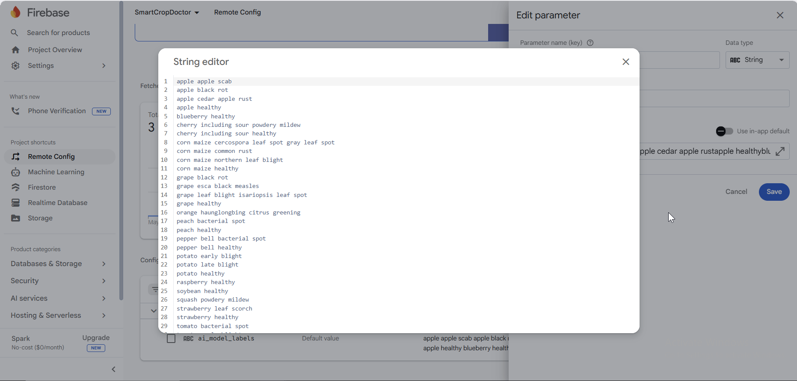
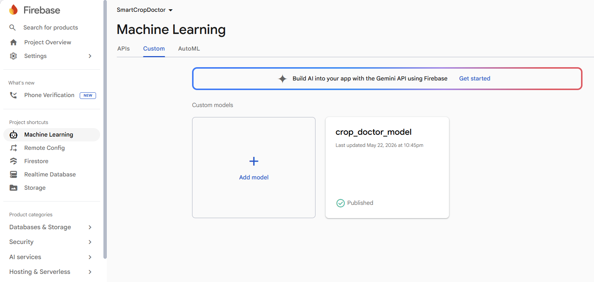
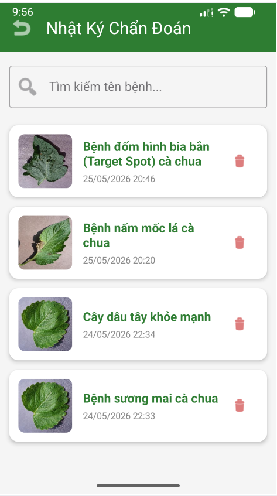
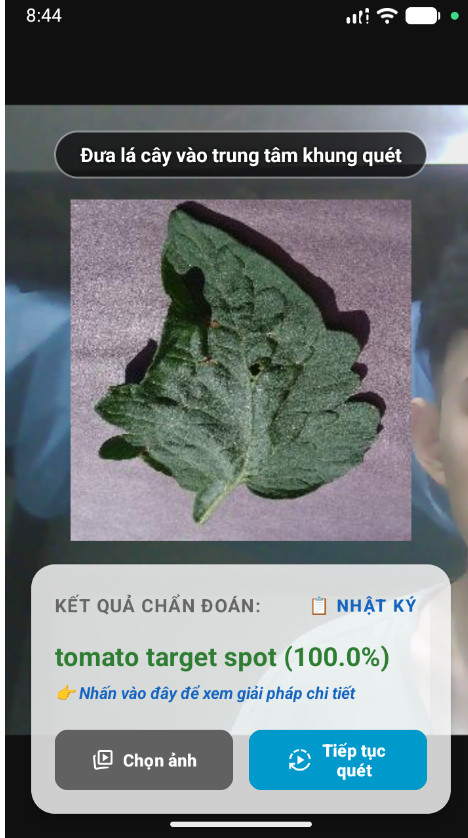
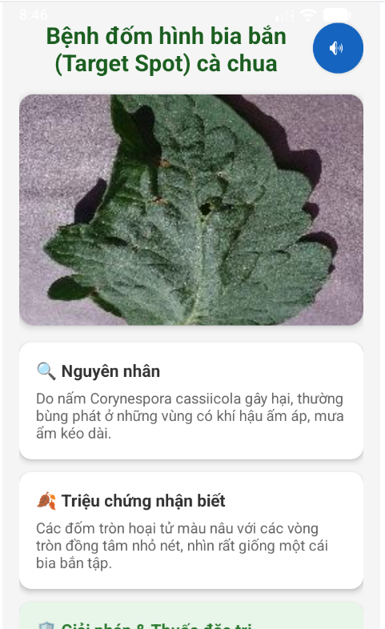
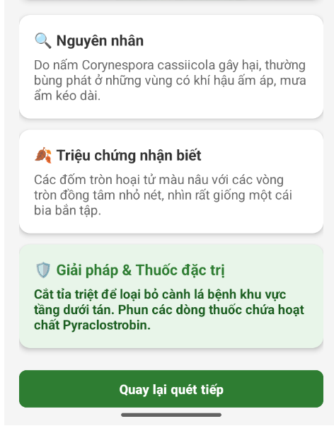
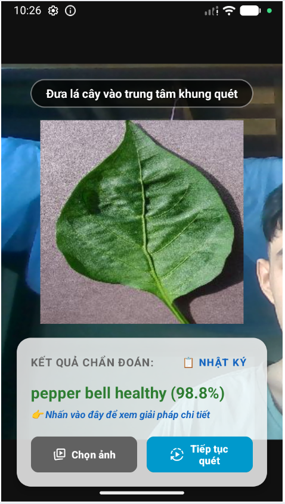
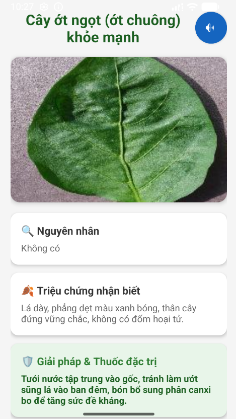

# Ứng Dụng Phân Tích Hình Ảnh Chuẩn Đoán Bệnh Cây Trồng Bằng AI (SmartCropDoctor-Android)

<p align="center">
  
  
  
</p>
<p align="center">
  
  
</p>

**Smart Crop Doctor** là ứng dụng di động chạy trên nền tảng Android, sử dụng Trí tuệ nhân tạo (AI) để phân tích hình ảnh và chẩn đoán các loại sâu bệnh trên lá cây (đốm lá, rỉ sắt, vàng lá...) theo thời gian thực. 

Dự án được thiết kế với tư duy kiến trúc mở, đóng vai trò là một mảnh ghép phân tích hình ảnh trong hệ sinh thái Nông nghiệp thông minh, sẵn sàng mở rộng kết hợp với các hệ thống phần cứng IoT (như vi điều khiển ESP32, cảm biến độ ẩm đất và hệ thống trực quan hóa ThingsBoard).

---

## 🚀 Tính Năng Cốt Lõi & Đáp Ứng Thang Điểm

### 1. Tối Ưu Hóa Nhận Diện Trên Thiết Bị Đầu Cuối
* **Kiến trúc LiteRT/TFLite ổn định:** Ứng dụng tích hợp mô hình AI (`model.tflite`) tối ưu hóa dung lượng, giảm thiểu thời gian suy luận (Inference Time) trực tiếp trên thiết bị đầu cuối mà không bị phụ thuộc vào API xử lý ảnh bên ngoài.
* **Xử lý luồng CameraX Real-time:** Sử dụng thuộc tính `ImageAnalysis` của Jetpack CameraX để trích xuất và phân tích khung hình camera theo thời gian thực. Toàn bộ tiến trình tính toán nặng được đẩy vào luồng phụ `ExecutorService` để giải phóng luồng giao diện chính (UI Thread), chống giật lag và quá nhiệt máy.

### 2. Linh Hoạt Điều Phối Theo Tư Duy MLOps (OTA)
Dịch bệnh cây trồng luôn biến đổi theo mùa vụ. Ứng dụng giải quyết bài toán cập nhật danh mục bệnh bằng cơ chế đám mây:
* **Cơ chế Dự phòng (Offline Fallback):** Nhúng sẵn tệp mô hình và file nhãn bệnh (`labels.txt`) trong thư mục `assets` giúp ứng dụng hoạt động ngoại tuyến ngay sau khi cài đặt.
* **Cập nhật Over-The-Air (OTA):** Khi có mạng, ứng dụng sử dụng `FirebaseRemoteConfig` để kéo cấu trúc nhãn bệnh mới nhất (`ai_model_labels`) kết hợp với `FirebaseModelDownloader` để tải ngầm phiên bản mô hình nâng cấp từ Firebase Console về máy.

### 3. Lưu Trữ Nhật Ký & Hỗ Trợ Tiện Ích Thông Minh
* **Hệ thống Nhật ký Chẩn đoán (SQLite):** Tích hợp SQLite Database thông qua `HistoryDatabaseHelper` để tự động lưu trữ lại mọi phiên quét bệnh thành công (gồm tên bệnh, thời gian dd/MM/yyyy và mảng bytes hình ảnh bệnh phẩm). Người dùng dễ dàng quản lý, xem lại phác đồ hoặc xóa bản ghi qua giao diện RecyclerView.
* **Bộ đọc Phác đồ bằng giọng nói (TTS):** Tích hợp công nghệ `TextToSpeech` hỗ trợ gói ngôn ngữ Tiếng Việt chuẩn, tự động chuyển đổi toàn bộ thông tin nguyên nhân, triệu chứng và cách chữa trị từ file cấu hình JSON thành giọng nói, tăng cường trải nghiệm thực địa cho nông dân.

---

## 🛠️ Công Nghệ Sử Dụng (Tech Stack)

* **IDE / Ngôn ngữ:** Android Studio | Java (JDK 11)
* **Quản lý Thư viện:** Gradle Kotlin DSL (`build.gradle.kts`) & Version Catalog (`libs.versions.toml`)
* **Camera Framework:** Jetpack CameraX (`Core`, `Camera2`, `Lifecycle`, `View`)
* **Machine Learning Runtime:** TensorFlow Lite (LiteRT API)
* **Cloud & MLOps:** Firebase (Firebase BoM, Remote Config, ML Model Downloader)
* **Local Storage:** SQLite (SQLiteOpenHelper), JSON Parsing (JSONObject)
* **Tiện ích hệ thống:** Android TextToSpeech API

---

## 📁 Cấu Trúc Thư Mục Dự Án (Cốt Lõi)
Dưới đây là sơ đồ tổ chức thư mục chính:
```text
📁 app/
└── 📁 src/
    └── 📁 main/
        ├── 📁 assets/
        │   ├── 📄 disease_solutions.json        # Danh mục giải pháp, phác đồ điều trị bệnh (JSON)
        │   ├── 📄 labels.txt                    # Danh sách nhãn tên bệnh cây trồng cục bộ
        │   └── 📄 model.tflite                  # Tệp mô hình AI mặc định (Offline Fallback)
        ├── 📁 java/ntu/viet773092/ungDungCdbct_65134318/
        │   ├── 📁 adapter/
        │   │   └── 📄 HistoryAdapter.java       # Bộ nạp dữ liệu và xử lý sự kiện cho danh sách Nhật ký
        │   ├── 📁 classifier/
        │   │   └── 📄 TFLiteClassifier.java     # Trình quản lý nạp mô hình AI (LiteRT/TFLite) và suy luận ảnh
        │   ├── 📁 database/
        │   │   └── 📄 HistoryDatabaseHelper.java # Cấu hình và quản lý cơ sở dữ liệu nhật ký chẩn đoán (SQLite)
        │   ├── 📁 ui/
        │   │   ├── 📄 DetailActivity.java       # Hiển thị chi tiết phác đồ, ảnh lớn bệnh và đọc TextToSpeech (TTS)
        │   │   ├── 📄 HistoryActivity.java      # Giao diện hiển thị danh sách nhật ký chẩn đoán đã lưu (RecyclerView)
        │   │   └── 📄 MainActivity.java         # Màn hình chính: Điều phối CameraX, phân tích luồng AI Đám mây/Offline
        │   └── 📄 MainApplication.java          # Lớp ứng dụng toàn cục: Đăng ký Lifecycle quản lý Context màn hình
        └── 📁 res/
            └── 📁 layout/
                ├── 📄 activity_main.xml         # UI Màn hình quét CameraX, khung kết quả chẩn đoán và các nút lệnh
                ├── 📄 activity_detail.xml       # UI Trang chi tiết giải pháp: Ảnh lớn, mô tả bệnh và nút phát âm thanh
                ├── 📄 activity_history.xml      # UI Trang danh sách nhật ký chẩn đoán
                └── 📄 item_history.xml          # UI Thiết kế từng dòng thẻ (Card) hiển thị trong Nhật ký

```

---

##  Cấu hình firebase

<p>Cấu hình các nhãn (tên các mẫu bệnh) của các loại lá cây trên Firebase:</p>



<p>Cấu hình model trên Firebase để ánh xạ đến ứng dụng Android:</p>



---
## 🎯 Kết quả thử nghiệm

### Nhật ký chẩn đoán (Hiển thị lịch sử quét của người dùng)

<div align="center">



</div>

***
### Bệnh **Tomato Target Spot** (Bệnh đốm bia bắn trên cà chua)

Ứng dụng đã nhận diện chính xác bệnh **Target Spot** trên lá cà chua qua camera:

<div align="center">

**Hình ảnh lá bệnh:**



**Kết quả quét từ ứng dụng:**





</div>

***
### **Pepper Bell Healthy** (Ớt chuông khỏe mạnh)

<div align="center">

**Hình ảnh lá ớt chuông:**



**Kết quả quét từ ứng dụng:**



</div>